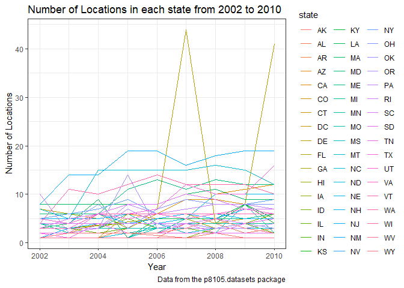
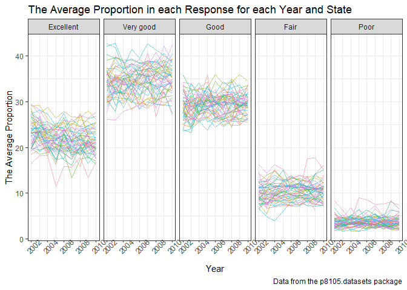
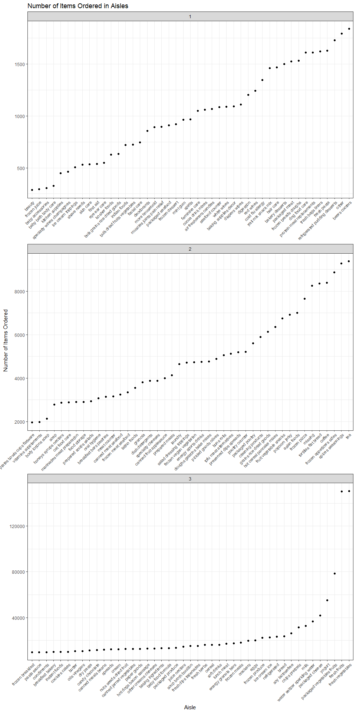
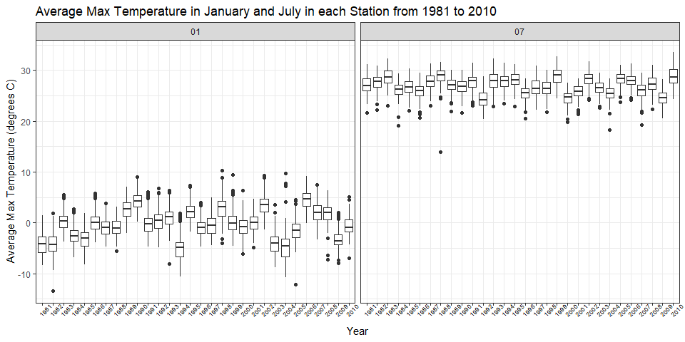
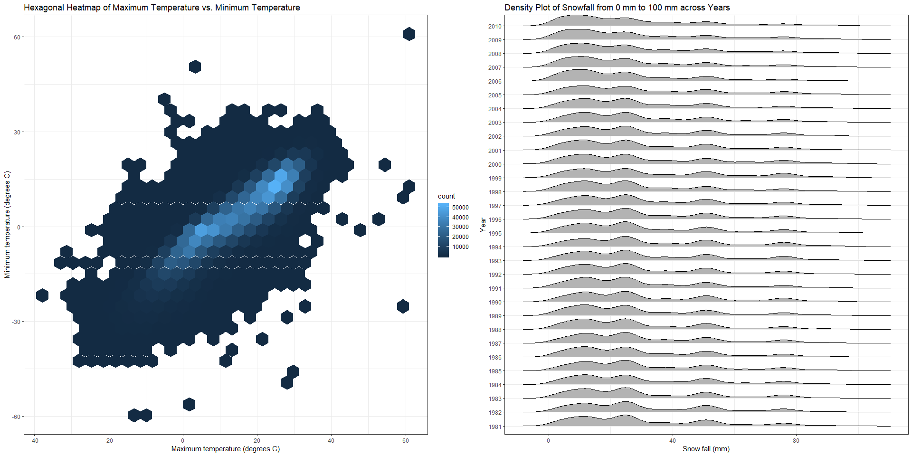

p8105\_hw3\_yw3095
================
Yixuan Wang
October 15, 2018

Problem 1
---------

This problem uses the BRFSS data.

-   Read and clean the data

``` r
hw3_brfss = brfss_smart2010 %>% 
  janitor::clean_names() %>% 
  filter(topic == "Overall Health", !is.na(response)) %>% 
  separate(locationdesc, into = c("remove", "county"), sep = " - ") %>% 
  rename(state = locationabbr) %>%
  select(-remove) %>% 
  mutate(response = as.factor(response), 
         response = ordered(response, levels = c("Excellent", "Very good", "Good", "Fair", "Poor")))
```

**Questions**

-   Question 1: In 2002, which states were observed at 7 locations?

``` r
hw3_1 = filter(hw3_brfss, year == 2002) %>%
  group_by(state) %>%  
  summarize(n_obs = n_distinct(county))
hw3_1 %>%
  filter(n_obs == 7) %>% 
  knitr::kable()
```

| state |  n\_obs|
|:------|-------:|
| CT    |       7|
| FL    |       7|
| NC    |       7|

``` r
skimr::skim(hw3_1)
```

    ## Skim summary statistics
    ##  n obs: 49 
    ##  n variables: 2 
    ## 
    ## -- Variable type:character ------------------------------------------------------------------------------------------------
    ##  variable missing complete  n min max empty n_unique
    ##     state       0       49 49   2   2     0       49
    ## 
    ## -- Variable type:integer --------------------------------------------------------------------------------------------------
    ##  variable missing complete  n mean   sd p0 p25 p50 p75 p100     hist
    ##     n_obs       0       49 49  3.2 2.21  1   1   3   4   10 <U+2587><U+2583><U+2582><U+2581><U+2581><U+2581><U+2581><U+2581>

**Answer: **

States CT, FL, and NC were observed at 7 locations. There were 49 states observed in 2002. Among these states, the mean value of the number of locations was 3.2, and the standard deviation was 2.21. The upper quartile was 4, so these three states which were observed 7 locations were in the first quartile of the dataset.

-   Question 2: Make a “spaghetti plot” that shows the number of locations in each state from 2002 to 2010.

``` r
hw3_brfss %>% 
  group_by(year, state) %>%  
  summarize(n = n_distinct(county)) %>% 
  ggplot(aes(x = year, y = n)) +
  geom_line(aes(color = state)) + 
  labs(
    title = "Number of Locations in each state from 2002 to 2010",
    x = "Year",
    y = "Number of Locations",
    caption = "Data from the p8105.datasets package"
  ) 
```



``` r
hw3_brfss %>% 
  group_by(year, state) %>%  
  summarize(n = n_distinct(county)) %>% 
  arrange(-n) %>% 
  head(10) %>% 
  knitr::kable()
```

|  year| state |    n|
|-----:|:------|----:|
|  2007| FL    |   44|
|  2010| FL    |   41|
|  2005| NJ    |   19|
|  2006| NJ    |   19|
|  2009| NJ    |   19|
|  2010| NJ    |   19|
|  2008| NJ    |   18|
|  2007| NJ    |   16|
|  2008| NC    |   16|
|  2010| TX    |   16|

**Comment:**

Because there were too many states in one plot, it was hard to tell each line. From the summarized table, we can know that most states have the similar trends. The number of locations in each state from 2002 to 2010 mainly lied between 0 to 10, while FL had two peaks and the peak values were 44 and 41.

-   Question 3: Make a table showing, for the years 2002, 2006, and 2010, the mean and standard deviation of the proportion of “Excellent” responses across locations in NY State.

``` r
hw3_brfss %>% 
  janitor::clean_names() %>%
  filter(state == "NY" & response == "Excellent") %>%
  filter(year == 2002 | year == 2006 | year == 2010) %>% 
  group_by(county) %>%  
  summarize(mean_excellent = mean(data_value, na.rm = TRUE),
            sd_excellent = sd(data_value, na.rm = TRUE)) %>%
  knitr::kable(digits = 1)
```

| county             |  mean\_excellent|  sd\_excellent|
|:-------------------|----------------:|--------------:|
| Bronx County       |             17.6|            NaN|
| Erie County        |             17.2|            NaN|
| Kings County       |             20.4|            1.8|
| Monroe County      |             22.4|            NaN|
| Nassau County      |             24.9|            2.8|
| New York County    |             27.5|            1.5|
| Queens County      |             19.6|            1.4|
| Suffolk County     |             24.1|            3.3|
| Westchester County |             26.4|            0.6|

**Comment:**

From the table, we can know that: Erie County in NY had the lowest mean value of "excellent" proportion, which is 17.2; New York County had the highest mean value of "excellent" proportion, which is 27.5; Monroe County was the median value of the "excellent" proportion, which is 22.4.

For the standard deviation of "excellent" proportion, we found that: There was 3 NA value in our table as there was only one observations for this county in 2002, 2006 or 2010. We cannot get the standard deviation of "excellent" proportion for those counties. Nassau County had the largest standard deviation, which is 2.8; Westchester County had the least standard deviation, which is 0.6.

-   Question 4: For each year and state, compute the average proportion in each response category (taking the average across locations in a state). Make a five-panel plot that shows, for each response category separately, the distribution of these state-level averages over time.

``` r
hw3_brfss %>%
  janitor::clean_names() %>%
  group_by(year, state, response) %>% 
  summarize(mean_proportion = mean(data_value, na.rm = TRUE)) %>% 
  ggplot(aes(x = year, y = mean_proportion, color = TRUE)) +
  geom_line(aes(color = state), alpha = .5) +
  facet_grid(.~response) + 
  labs(
    title = "The Average Proportion in each Response for each Year and State",
    x = "Year",
    y = "The Average Proportion",
    caption = "Data from the p8105.datasets package"
  ) +
  theme(legend.position = "none",axis.text.x = element_text(angle = 45))
```



**Comment:**

From the plot, we can know that:

"Very Good" had the highest proportion across years, "Good", "Excellent", "Fair" followed, and "Poor" had the lowest proportion. Generally, the average proportion change in each response acorss years were stable. Also, we can see that the average proportion in "Poor" response acrosses years was very similar among states.

Problem 2
---------

This problem uses the Instacart data.

-   Read and clean the data

``` r
hw3_insta = instacart %>% 
  janitor::clean_names()
  skimr::skim(hw3_insta)
```

    ## Skim summary statistics
    ##  n obs: 1384617 
    ##  n variables: 15 
    ## 
    ## -- Variable type:character ------------------------------------------------------------------------------------------------
    ##      variable missing complete       n min max empty n_unique
    ##         aisle       0  1384617 1384617   3  29     0      134
    ##    department       0  1384617 1384617   4  15     0       21
    ##      eval_set       0  1384617 1384617   5   5     0        1
    ##  product_name       0  1384617 1384617   3 159     0    39123
    ## 
    ## -- Variable type:integer --------------------------------------------------------------------------------------------------
    ##                variable missing complete       n       mean        sd p0
    ##       add_to_cart_order       0  1384617 1384617       8.76      7.42  1
    ##                aisle_id       0  1384617 1384617      71.3      38.1   1
    ##  days_since_prior_order       0  1384617 1384617      17.07     10.43  0
    ##           department_id       0  1384617 1384617       9.84      6.29  1
    ##               order_dow       0  1384617 1384617       2.7       2.17  0
    ##       order_hour_of_day       0  1384617 1384617      13.58      4.24  0
    ##                order_id       0  1384617 1384617 1706297.62 989732.65  1
    ##            order_number       0  1384617 1384617      17.09     16.61  4
    ##              product_id       0  1384617 1384617   25556.24  14121.27  1
    ##               reordered       0  1384617 1384617       0.6       0.49  0
    ##                 user_id       0  1384617 1384617   1e+05     59487.15  1
    ##     p25     p50     p75    p100     hist
    ##       3       7      12      80 <U+2587><U+2583><U+2581><U+2581><U+2581><U+2581><U+2581><U+2581>
    ##      31      83     107     134 <U+2583><U+2587><U+2583><U+2583><U+2587><U+2585><U+2585><U+2586>
    ##       7      15      30      30 <U+2582><U+2585><U+2583><U+2583><U+2581><U+2582><U+2581><U+2587>
    ##       4       8      16      21 <U+2583><U+2587><U+2582><U+2581><U+2582><U+2586><U+2581><U+2583>
    ##       1       3       5       6 <U+2587><U+2585><U+2583><U+2583><U+2581><U+2583><U+2585><U+2585>
    ##      10      14      17      23 <U+2581><U+2581><U+2583><U+2587><U+2587><U+2587><U+2585><U+2582>
    ##  843370 1701880 2568023 3421070 <U+2587><U+2587><U+2587><U+2587><U+2587><U+2587><U+2587><U+2587>
    ##       6      11      21     100 <U+2587><U+2582><U+2581><U+2581><U+2581><U+2581><U+2581><U+2581>
    ##   13380   25298   37940   49688 <U+2586><U+2586><U+2587><U+2587><U+2587><U+2586><U+2587><U+2587>
    ##       0       1       1       1 <U+2586><U+2581><U+2581><U+2581><U+2581><U+2581><U+2581><U+2587>
    ##   51732   1e+05  154959  206209 <U+2587><U+2587><U+2587><U+2587><U+2587><U+2587><U+2587><U+2587>

**Description of the dataset**

There were 1384617 observations and 15 variables in the instacart dataset, and no missing values. Each observation was a record for an order with information about the app user and product description, such as user\_id, order number, product\_name, aisle, whether is reordered, and department, etc. The key variables are user\_id, order\_id, product\_name, asile, and reordered. With these variables, we can track the order history for each user, also we had the information that which item or which aisle had the higher probability to be reordered. There are 131209 distinct users and 39123 distinct products purchased by customers.

**Questions**

-   Question 1: How many aisles are there, and which aisles are the most items ordered from?

``` r
count(hw3_insta, aisle) %>% 
  arrange(-n) %>% 
  head(5) %>% 
  knitr::kable()
```

| aisle                      |       n|
|:---------------------------|-------:|
| fresh vegetables           |  150609|
| fresh fruits               |  150473|
| packaged vegetables fruits |   78493|
| yogurt                     |   55240|
| packaged cheese            |   41699|

**Answer:**

There are 134 aisles in the instacart dataset. Fresh vegetables is the most items ordered from, and there are 150609 orders from fresh vegetables. The following popular items were fresh fruits, pachaged vagetables fruits, yogurt, and packaged cheese. From the results, we can know that people are more likely to buy fresh vegetables or fruits rather than packaged ones, which indicating a health life style.

-   Question 2: Make a plot that shows the number of items ordered in each aisle.

``` r
hw3_insta %>%
  group_by(aisle) %>%
  summarize(n = n()) %>%
  mutate(group = as.numeric(cut_number(n, 3))) %>% 
  ggplot(aes(x = reorder(aisle, n), y = n)) +
  geom_point() +
  facet_wrap(group ~ ., nrow = 3, scales = "free") +
  theme(axis.text.x = element_text(size = 8, hjust = 1, angle = 45)) +
  labs(
      title = "Number of Items Ordered in Aisles",
      x = "Aisle",
      y = "Number of Items Ordered"
      )
```



**Comment:**

After ranking the total number of items, we found that the shape of the line plot was like a "J". Nearly, one third of the aisles had less than 2000 ordered item, another one third of the aisles had ordered items from 2000 to 10000, while the other one third of the aisles had ordered items from 20000 to 80000. The aisles "fresh fruits" and "fresh vegetables" even had more than 150000 ordered items.

-   Question 3: Make a table showing the most popular item in each of the aisles “baking ingredients”, “dog food care”, and “packaged vegetables fruits”.

``` r
hw3_insta %>% 
  filter(aisle == "baking ingredients" | aisle == "dog food care" | aisle == "packaged vegetables fruits") %>%      
  group_by(aisle, product_name) %>%
  summarize(n = n()) %>% 
  arrange(-n) %>% 
  filter(row_number() == 1) %>% 
  knitr::kable()
```

| aisle                      | product\_name                                 |     n|
|:---------------------------|:----------------------------------------------|-----:|
| packaged vegetables fruits | Organic Baby Spinach                          |  9784|
| baking ingredients         | Light Brown Sugar                             |   499|
| dog food care              | Snack Sticks Chicken & Rice Recipe Dog Treats |    30|

**Answer:**

In aisle “baking ingredients”, the most popular item was "Light Brown Sugar", which had been ordered 499 times. In aisle “dog food care”, the most popular item was "Snack Sticks Chicken & Rice Recipe Dog Treats", which had been ordered 30 times. In aisle “packaged vegetables fruits”, the most popular item was "Organic Baby Spinach", which had been ordered 9784 times.

As these three items are the most popular items in these three aisles, the staff should prepare these goods in advance in case they were out of stock or customers cannot get their order in time.

-   Question 4: Make a table showing the mean hour of the day at which Pink Lady Apples and Coffee Ice Cream are ordered on each day of the week.

``` r
hw3_insta %>% 
  filter(product_name == "Pink Lady Apples" | product_name == "Coffee Ice Cream") %>%      
  group_by(product_name, order_dow) %>%
  summarize(mean_hour_of_day = mean(order_hour_of_day)) %>% 
  spread(key = product_name, value = mean_hour_of_day) %>% 
knitr::kable(digits = 1)
```

|  order\_dow|  Coffee Ice Cream|  Pink Lady Apples|
|-----------:|-----------------:|-----------------:|
|           0|              13.8|              13.4|
|           1|              14.3|              11.4|
|           2|              15.4|              11.7|
|           3|              15.3|              14.2|
|           4|              15.2|              11.6|
|           5|              12.3|              12.8|
|           6|              13.8|              11.9|

**Comment:** Without any other information, we assume that the 0 for order\_dow reprented Sunday, 1 represented Monday, and so on, 6 represented Saturday. Generally, people would order "Coffee Ice Cream" in the afternoon from 1 pm to 4 pm as a dessert due to the higher temprature or relax from the work. And people would like to order "Pink Lady Apples" in the morning and noon from 11 am to 1 pm as their healthy brunch.

Problem 3
---------

This problem uses the NY NOAA data.

-   Read and clean the data

``` r
hw3_ny_noaa = ny_noaa %>% 
  janitor::clean_names() %>% 
  separate(date, into = c("year", "month", "day"), sep = "-") %>% 
  mutate(prcp = as.numeric(prcp),
         tmax = as.numeric(tmax),
         tmin = as.numeric(tmin),
         prcp = prcp / 10,
         tmin = tmin / 10,
         tmax = tmax / 10)
  skimr::skim(hw3_ny_noaa)
```

    ## Skim summary statistics
    ##  n obs: 2595176 
    ##  n variables: 9 
    ## 
    ## -- Variable type:character ------------------------------------------------------------------------------------------------
    ##  variable missing complete       n min max empty n_unique
    ##       day       0  2595176 2595176   2   2     0       31
    ##        id       0  2595176 2595176  11  11     0      747
    ##     month       0  2595176 2595176   2   2     0       12
    ##      year       0  2595176 2595176   4   4     0       30
    ## 
    ## -- Variable type:integer --------------------------------------------------------------------------------------------------
    ##  variable missing complete       n  mean     sd  p0 p25 p50 p75  p100
    ##      snow  381221  2213955 2595176  4.99  27.22 -13   0   0   0 10160
    ##      snwd  591786  2003390 2595176 37.31 113.54   0   0   0   0  9195
    ##      hist
    ##  <U+2587><U+2581><U+2581><U+2581><U+2581><U+2581><U+2581><U+2581>
    ##  <U+2587><U+2581><U+2581><U+2581><U+2581><U+2581><U+2581><U+2581>
    ## 
    ## -- Variable type:numeric --------------------------------------------------------------------------------------------------
    ##  variable missing complete       n  mean    sd    p0  p25  p50  p75 p100
    ##      prcp  145838  2449338 2595176  2.98  7.82   0    0    0    2.3 2286
    ##      tmax 1134358  1460818 2595176 13.98 11.14 -38.9  5   15   23.3   60
    ##      tmin 1134420  1460756 2595176  3.03 10.4  -59.4 -3.9  3.3 11.1   60
    ##      hist
    ##  <U+2587><U+2581><U+2581><U+2581><U+2581><U+2581><U+2581><U+2581>
    ##  <U+2581><U+2581><U+2582><U+2587><U+2587><U+2586><U+2581><U+2581>
    ##  <U+2581><U+2581><U+2581><U+2586><U+2587><U+2582><U+2581><U+2581>

**Description of the dataset**

There are 2595176 observations and 9 variables in the ny\_noaa dataset. Each observation included the information that weather station ID, date of observation, precipitation (tenths of mm), Snowfall (mm), Snow depth (mm), Maximum temperature (tenths of degrees C), and Minimum temperature (tenths of degrees C). The key variables are id, date, prcp, snow, tmax, and tmin. Each weather station may collect only a subset of these variables, and therefore the resulting dataset contains extensive missing data. There were almost half of records missing values for tmax and tmin, which could influence the analysis and prediction of temprature change.

**Questions**

-   Question 1: For snowfall, what are the most commonly observed values? Why?

``` r
hw3_ny_noaa %>% 
  count(snow) %>% 
  arrange(-n) %>%
  head(5) %>% 
  knitr::kable()
```

|  snow|        n|
|-----:|--------:|
|     0|  2008508|
|    NA|   381221|
|    25|    31022|
|    13|    23095|
|    51|    18274|

**Answer:**

For snowfall, 0 are the most commonly observed values. In NY, snowfall only occurs in winter seasonally. So most of the time in a year there will not be snowfalls. Even in winter, the days with snowfalls were less than sunny day or rainny days.

-   Question 2: Make a two-panel plot showing the average max temperature in January and in July in each station across years. Is there any observable / interpretable structure? Any outliers?

``` r
hw3_ny_noaa %>% 
  filter(month == "01" | month == "07") %>%
  filter(!is.na(tmax)) %>% 
  group_by(id, year, month) %>% 
  summarize(mean_tmax = mean(tmax, na.rm = TRUE)) %>% 
  ggplot(aes(x = year, y = mean_tmax)) +
  geom_boxplot() +
  facet_grid(.~month) +
  theme(axis.text.x = element_text(face = "plain", color = "black", 
                           size = 7, angle = 45), legend.position = "none") +
  labs(
    title = "Average Max Temperature in January and July in each Station from 1981 to 2010",
    x = "Year",
    y = "Average Max Temperature (degrees C)"
  )
```



**Comment:**

In January, most of the max temperature lies between -10˚C to 10˚C, and the average maximum temperature across years centered around 0˚C. In July, most of the max temperature lies between 22˚C to 32˚C, and the average maximum temperature across years centered around 27˚C.

There are quite a few outliers in January and July in each year. The max temperature in July 1987 was an extermely outliers, which was less than 15˚C much lower than other years.

-   Question 3: Make a two-panel plot showing (i) tmax vs tmin for the full dataset (note that a scatterplot may not be the best option); and (ii) make a plot showing the distribution of snowfall values greater than 0 and less than 100 separately by year.

``` r
plot_1 = ggplot(hw3_ny_noaa, aes(x = tmax, y = tmin)) +
  geom_hex() + 
  labs(
    title = "Hexagonal Heatmap of Maximum Temperature vs. Minimum Temperature",
    x = "Maximum temperature (degrees C)",
    y = "Minimum temperature (degrees C)"
  )

plot_2 =  filter(hw3_ny_noaa, snow > 0 & snow < 100) %>% 
  ggplot(aes(x = snow, y = year)) +
  geom_density_ridges(scale = .85) +
  labs(
    title = "Density Plot of Snowfall from 0 mm to 100 mm across Years",
    x = "Snow fall (mm)",
    y = "Year"
  )

plot_1 + plot_2
```

    ## Warning: Removed 1136276 rows containing non-finite values (stat_binhex).



**Comment:**

For the hexagonal heatmap, we can know that the light blue means high desity, and it seems like there was a positive linear relationship between maximum temperature and minimum temperature across years.

For the desity plot, we can know that the snow fall desity was similar across years. There are four peaks in a year: lied around 10mm, 30mm, 50mm, and 70mm. The peak at around 10mm had the highest density, and the peak at around 70mm had the lowest density.
